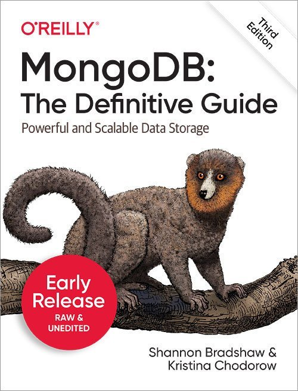
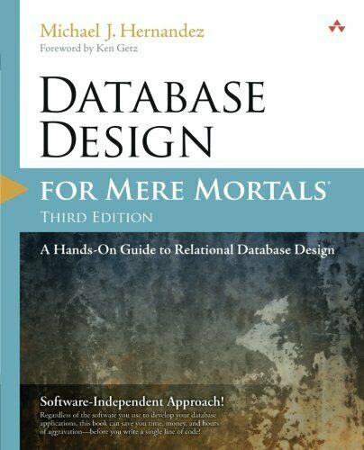

# MongoDB
My works related to MongoDB cross-platform, general purpose, document-based, distributed database.

## Table of Contents
1. [Introduction.](#introduction)
2. [Official references websites.](#references)
3. [Running MongoDB as a Windows Service.](#windowservice)
4. [Mongo Daemon, mongod.](#mongod)
5. [Book references.](#books)
6. [GitHub notes.](#github)
7. [GitHub repository calculation.](#calculation)

<a name="introduction"></a>
## 1. Introduction.
 
MongoDB is a cross-platform document-oriented database program. Classified as a NoSQL database program, MongoDB uses JSON-like documents with schema. MongoDB is developed by MongoDB Inc. and licensed under the Server Side Public License (SSPL).

<a name="references"></a>
## 2. Official references websites. <br />
MongoDB official website : https://www.mongodb.com <br />
MongoDB official documentation : https://docs.mongodb.com <br />
MongoDB Community Server : https://www.mongodb.com/download-center/community <br />

**_MongoDB in financial sector_** <br />
Citibank : https://online.citi.com <br />
Hongkong and Shanghai Banking Corporation (HSBC) : https://www.hsbc.com <br />

**_MongoDB questions and answers_** <br />
Stack Overflow questions and answers website : https://stackoverflow.com/ <br />

**_MongoDB questions and answers by Stack Overflow_** <br />
mongodb service is not starting up by Stack Overflow : https://stackoverflow.com/questions/9884233/mongodb-service-is-not-starting-up <br />
mongod command not recognized when trying to connect to a mongodb server by Stack Overflow : https://stackoverflow.com/questions/15053893/mongod-command-not-recognized-when-trying-to-connect-to-a-mongodb-server/41507803 <br />
Command to show the db that I'm currently using in MongoDB? by Stack Overflow : https://stackoverflow.com/questions/16004182/command-to-show-the-db-that-im-currently-using-in-mongodb <br />

**_MongoDB related technologies_** <br />
MongoDB Stitch : https://www.mongodb.com/cloud/stitch <br />
Mocha : https://mochajs.org, https://github.com/mochajs/mocha <br />
Robo 3T : https://robomongo.org, https://github.com/Studio3T/robomongo <br />
Homebrew package manager : https://brew.sh <br />
JSON formatter : https://jsonformatter.curiousconcept.com/ <br />
JSON formatter by jsonformatter.org : https://jsonformatter.org/ <br />

**_MongoDB documentation by MongoDB_** <br />
MongoDB Drivers and ODM by MongoDB : https://docs.mongodb.com/ecosystem/drivers/ <br />
Documents by MongoDB : https://docs.mongodb.com/manual/core/document <br />
WiredTiger Storage Engine by MongoDB : https://docs.mongodb.com/manual/core/wiredtiger/ <br />
mongod by MongoDB : https://docs.mongodb.com/manual/reference/program/mongod/ <br />
mongo Shell Quick Reference by MongoDB : https://docs.mongodb.com/manual/reference/mongo-shell/ <br />
MongoDB CRUD Operations by MongoDB : https://docs.mongodb.com/manual/crud/ <br />
BSON Types by MongoDB : https://docs.mongodb.com/manual/reference/bson-types/ <br />
JSON and BSON by MongoDB : https://www.mongodb.com/json-and-bson <br />
Model Data for Atomic Operations by MongoDB : https://docs.mongodb.com/manual/tutorial/model-data-for-atomic-operations/ <br />
$set by MongoDB : https://docs.mongodb.com/manual/reference/operator/update/set/ <br />
$gt by MongoDB : https://docs.mongodb.com/manual/reference/operator/query/gt/ <br />
db.collection.update() by MongoDB : https://docs.mongodb.com/manual/reference/method/db.collection.update/ <br />
db.collection.deleteMany() by MongoDB : https://docs.mongodb.com/manual/reference/method/db.collection.deleteMany/ <br />
db.collection.insertMany() by MongoDB : https://docs.mongodb.com/manual/reference/method/db.collection.insertMany/ <br />
db.collection.find() by MongoDB : https://docs.mongodb.com/manual/reference/method/db.collection.find/ <br />
cursor.pretty() by MongoDB : https://docs.mongodb.com/manual/reference/method/cursor.pretty/ <br />
cursor.forEach() by MongoDB : https://docs.mongodb.com/manual/reference/method/cursor.forEach/ <br />
Cursor Methods by MongoDB : https://docs.mongodb.com/manual/reference/method/js-cursor/ <br />
Write Scripts for the mongo Shell by MongoDB : https://docs.mongodb.com/manual/tutorial/write-scripts-for-the-mongo-shell/ <br />
cursor.toArray() by MongoDB : https://docs.mongodb.com/manual/reference/method/cursor.toArray/ <br />
db.collection.updateOne() by MongoDB : https://docs.mongodb.com/manual/reference/method/db.collection.updateOne/ <br />
db.collection.findOne() by MongoDB : https://docs.mongodb.com/manual/reference/method/db.collection.findOne/ <br />
Data Models by MongoDB : https://docs.mongodb.com/manual/data-modeling/ <br />

**_MongoDB related articles_** <br />
How to set up MongoChef to ease your MongoDB admin challenges by techrepublic.com : https://www.techrepublic.com/article/how-to-set-up-mongochef-to-ease-your-mongodb-admin-challenges/ <br />
Blending the ORM and MongoDB ODM by doctrine-project.org : https://www.doctrine-project.org/projects/doctrine-mongodb-odm/en/2.0/cookbook/blending-orm-and-mongodb-odm.html <br />
Webinar: How Retail Banks Use MongoDB by MongoDB : https://www.mongodb.com/presentations/webinar-how-retail-banks-use-mongodb <br />
Transforming Financial Services by MongoDB : https://www.mongodb.com/industries/financial-services <br />
How DevOps, Microservices, and MongoDB are Making HSBC “Simpler, Better, and Faster” by MongoDB : https://www.mongodb.com/blog/post/how-devops-microservices-and-mongodb-are-making-hsbc-simpler-better-and-faster <br />

<a name="windowservice"></a>
## 3. Running MongoDB as a Windows Service.
If you installed MongoDB as a service from the server page of https://www.mongodb.com/download-center/community, you need to open the Windows command line program and copy and paste the below command on your command line program.

```
"C:\Program Files\MongoDB\Server\4.2\bin\mongo.exe"
```

Make sure the number is as same as what you installed in your local machine.
Make sure the program is always running when you want to use MongoDB database.

Read the official MongoDB documentation for better explanation : https://docs.mongodb.com/manual/tutorial/install-mongodb-on-windows/

<a name="mongod"></a>
## 4. Mongo Daemon, mongod.
mongod is the primary daemon process for the MongoDB system. It handles data requests, manages data access, and performs background management operations.

To use mongod, first you need to setup the windows environment, try to find where is your MongoDB binaries installed in your local machine, for example `C:\Program Files\MongoDB\Server\4.2\bin`, copy the address location from the address bar by pressing **[ Ctrl ] + **[ C ]**, then on the task bar, on the left of windows ⊞ logo, type `environment`, under `Best Match` text, find the text `Edit the system environment variables`, then hover the mouse on that text and **[ Mouse Left Click ]** on it, the `System properties` menu will appear on the screen, press **[ N ]** on your keyboard and `Environment Variables` menu will appear on the screen. Press **[ P ]** and make sure the `Path` is highlighted on the screen, then press **[ Tab ]**, **[ E ]** on your keyboard, then press **[ Tab ]**, **[ N ]**, then press **[ Ctrl ]** + **[ V ]** on your keyboard to paste the address of MongoDB binaries into windows environment variable, and then press **[ Enter ]**, **[ Enter ]**, **[ Enter ]**, **[ Tab ]**, **[ Enter ]**.

After setting the windows environment variable, then test the mongod command.
```
$ mongod
```

<a name="books"></a>
## 5. Book references.
**_Mongodb: the Definitive Guide_** by Shannon Bradshaw and Kristina Chodorow (Third Edition) <br />
 
<br /><br />
**_Database Design for Mere Mortals : A Hands-On Guide to Relational Database Design_** by Michael J. Hernandez (Third Edition) <br />
 

<a name="github"></a>
## 6. GitHub notes.
Clone the current GitHub remote repository contents into local machine.
```
$ git clone https://github.com/syakirharis25/MongoDB.git
$ cd MongoDB/
$ git remote -v
$ git status
```

<a name="calculation"></a>
## 7. GitHub repository calculation.
```
-------------------------------------------------------------------------------
Language                     files          blank        comment           code
-------------------------------------------------------------------------------
Markdown                         1              5              0             29
-------------------------------------------------------------------------------
```
Refer to : https://github.com/syakirharis25/cloc
